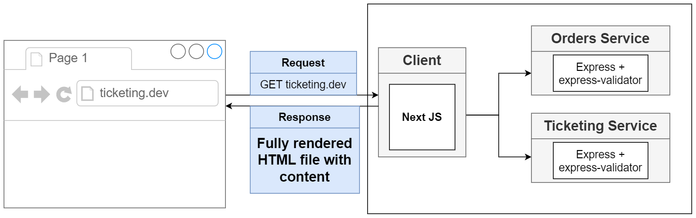
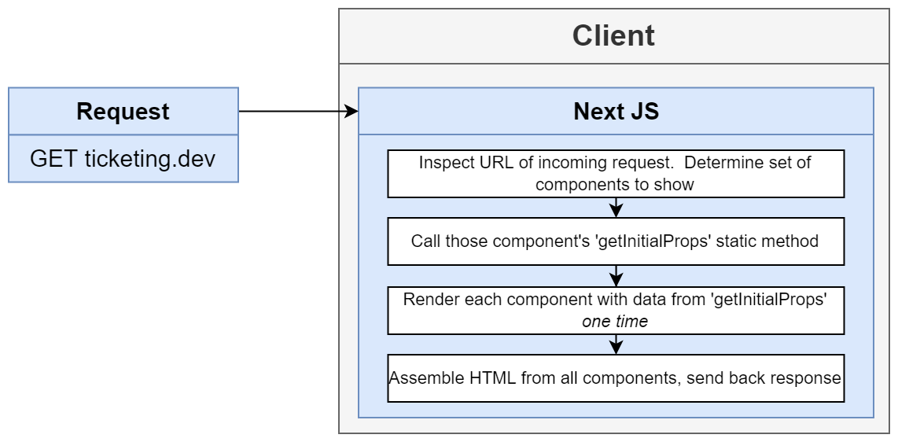
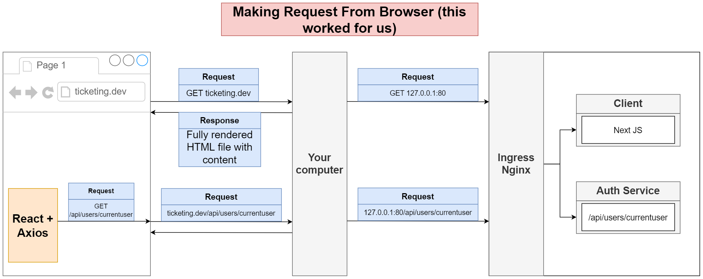
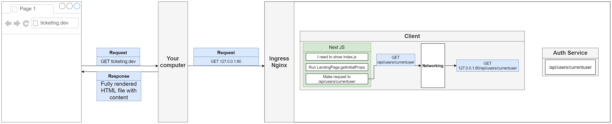
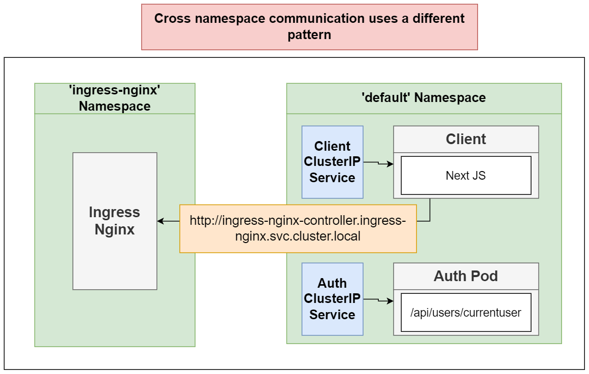

## Client

We will be writing the Next app using JavaScript, not Typescript. It would be normally beneficial to use TS, but this app in particular would need a lot of extra TS stuff written out for little benefit.

`getInitialProps` is the only location where we can fetch data during the server side rendering process. However, since we are using k8s, if we directly fetch data in `getInitialProps`, such as calling a `GET request`, it will cause an error.

**What we want**

**What actually happend**

The request went to the localhost inside of the Client container while there is nothing running on port 80 inside that container.

Thus, we need to make a request to Ingress-Nginx from Client so that Ingress will access to the port 80 in auth container.

**Solution**

